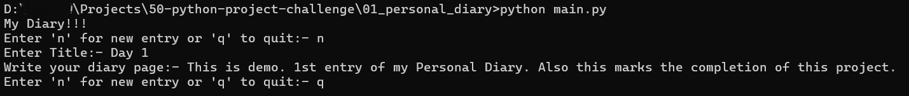

# 01 - Personal Diary (CLI)

A simple Command Line Interface (CLI) to create and manage your thoughts with automatic time-stampings.

## 📝 Description

As a part of **50 Python Project Challenge**, it is the 1st project. The goal of this project is the to get familar with file I/O (Input and Output) in Python. Tha app allows to write entries in .txt file, ensuring that each entries is preceded with exact data and time of creation

## 🚀 Features
* **Write-Entries** - Takes Title and Content as input directly from the terminal
* **Auto-TimeStamp** - Using datetime module to create timestamp at the time of saving the entry.
* **Save as txt file** - Saves each entry as text file with filename format of "YYYY-MM-DD HH-MM-SS.txt"
* **Diary Page** - Each entry is stored an individual Diary Page.

## 🛠️ Tech-Stack
* **Languages** - Python 3.13.9
* **Modules** - 'datetime'

## ⚙️ Installation Guide
1. **Clone the repository:-**
   ```bash
   git clone https://github.com/Kokate-Rushik/50-python-project-challenge.git
   cd 50-python-project-challenge
   cd 01_personal_diary

2. **Run the application**
   ```bash
   python main.py
3. **Follow the prompt**
   * press 'n' to enter new entry (Diary Page).
   * press 'q' to save and exit the application.
## 📸 **Demo**

1. **Installation Guide**
   

2. **Run the Application**
   


## ✍️ **Author**
* Kokate Rushik
* Challenge: 50 Python Project in 6 months