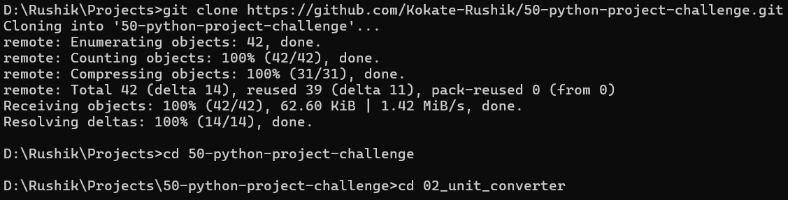
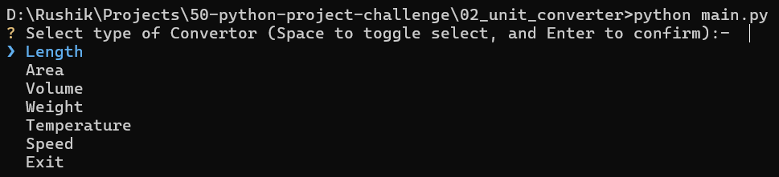
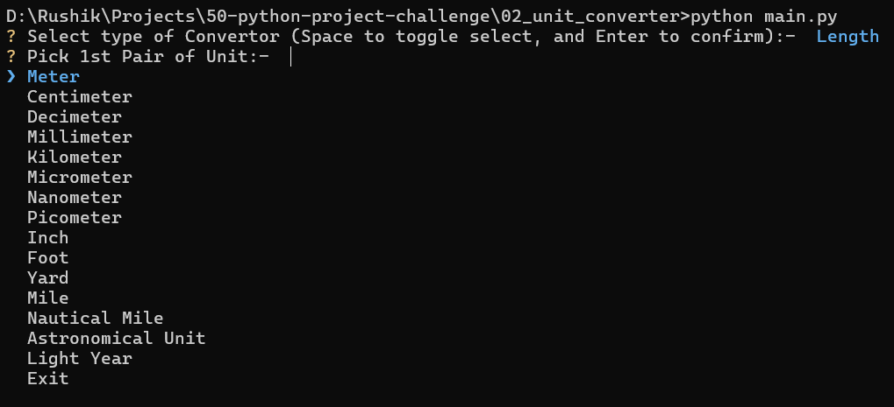
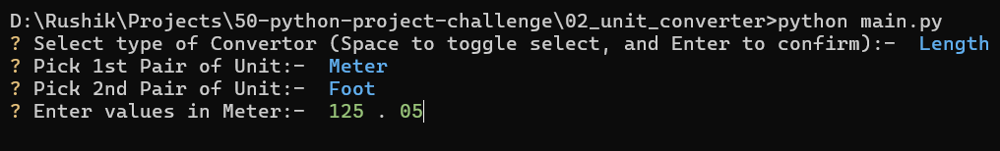
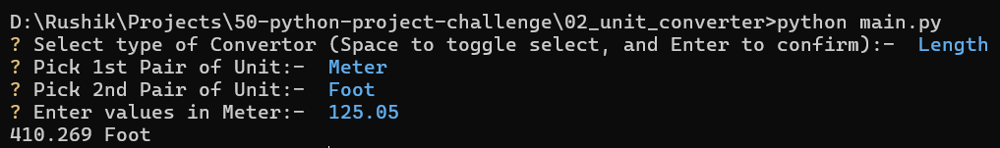

# 02 - Unit Converter (CLI)

A simple Command Line Interface (CLI) for unit conversion. Offers options for converting between common units of Length, Area, Volume, Weight, Temperature and Speed.

## 📝 **Description**

As a part of **50 Python Project Challenge**, this is the 2nd project. The goal of this project is to master structured data mapping, dynamic function execution and advancing Command Line Interface (CLI) interactions.
The app provides robust terminal interface for converting complex unit across multiple categories (Length, Area, Volume, Weight, Temperature and Speed).

## 🚀 **Features**
* **Multi-Category Support** - Supports 6 distinct conversion tyoes: Area, Volume, Weight, Temperature and Speed.
* **Interactive CLI** - Utilizes `InquirerPy` for a modern command-line interface, featuring arrow-key navigation and auto-complete selection.
* **Pivot-Based Logic** - Uses a "Base Unit" system (eg. converting everything to Meters first) to allow seamless conversion between any two units within a category.
* **Linear & Non-Linear Math** - Implements standard scaling for distances and weights while handling complex offset formula (Celsius ↔ Fahrenheit) for temperatures.
* **Input Validation** - Prevents application crashes by ensuring user inputs are valid numbers before attempting calculations
* **Dynamic Routing** - Uses a centralized controller to manage navigation between the main menu and specific conversion sub-menus.

## 🛠️ **Tech-Stack**
* **Language** - Python 3.13.9
* **Modules** - 'InquirerPy'

## ⚙️ **Installation Guide**
1. **Clone the repository:-**
   ```bash
   git clone https://github.com/Kokate-Rushik/50-python-project-challenge.git
   cd 50-python-project-challenge
   cd 02_unit_converter

2. **Run the application**
   ```bash
   python main.py

3. **Follow the prompt**
   * use arrow keys to select category (Length, Area, Volume, etc)
   * again use arrow keys to select fromUnit and toUnit
   * then enter the magnitude in digits

## 📸 **Demo**

1. **Installation Guide**
   
   
2. **Run the Applications**
   

3. **Following the prompt**
   
   
   


## ✍️ **Author**
* Kokate Rushik
* Challenge: 50 Python Project in 6 months