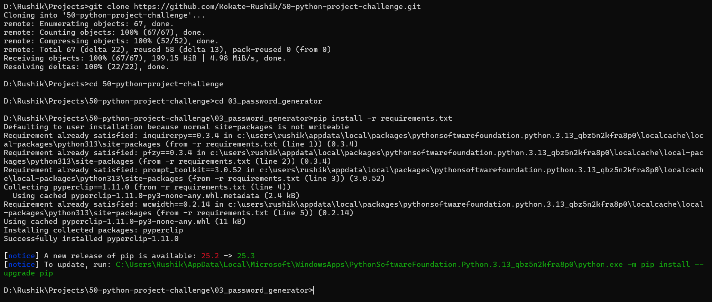
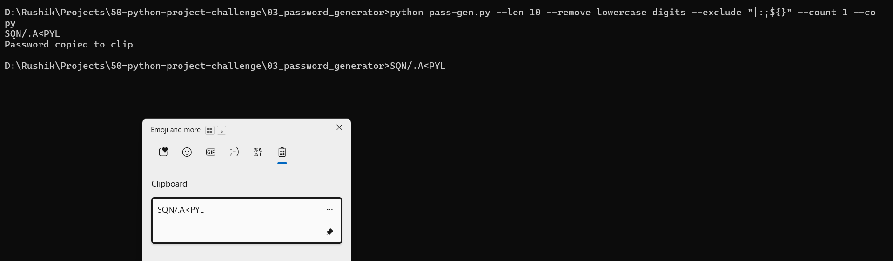
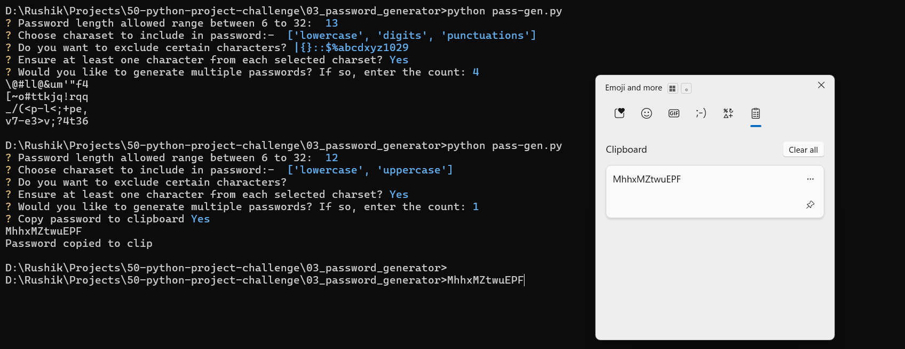

# 03 - Password Generator (CLI)

A dual-mode utility for generating cryptographically secure password. It features both a user-friendly interactive walkthrough and a high-speed command-line argument mode for power users.

## 📝 **Description**

As a part of **50 Python Project Challenge**, this is the 3rd project. The goal of this project is to advance beyond basic logic into **cryptographically secure randomization, system-level automation (Clipboard)**, and **dual-interface design** using Argument Parsing and interactive prompts.

This application uses the `secrets` module - the industry standard for security - rather than the standard `random` module. It features a sophisticated "SuperString" generator that dynamically builds a character pool based on user-defined inclusions and explicit exclusions, ensuring the output meets strict policies.

## 🚀 **Features**
* **Dual-Interface Navigation** - Supports both an interactive **Prompt Mode** (for beginners) and a **Flag Mode** (using `argparse`) for automation and rapid use.
* **Cryptographic Security** - Implements the `secrets` module to ensure password are secure against predictability, making them suitable for real-world account protection
* **Intelligent Character Pooling** - Features a custom genSuperString engine that combines `string` module constants and performs set-subtraction to handle specific character exclusions.
* **Bulk Generation** - Allows users to generate multiple password at once (`--count`), perfect for batch-creating credentials for new systems.
* **Clipboard Integration** - Uses `pyperclip` to automatically copy generated passwords to the system clipboard, reducing the risk of exposure through manual typing.
* **Input Sanitization** - Features robust validation using `NumberValidator` and `lambda` filters to ensure password length and counts stay within logical bounds.
* **Advanced Exclusion Logic** - Provides the ability to "blacklist" specific characters from the pool, useful for systems that don't allow confusing characters like `0`, `O`, `1`, `l` or `I`.

## 🛠️ **Tech-Stack**
* **Landuage** - Python 3.13.9
* **Modules** - `secrets`, `argparse`, `InquirerPy`, `string`, `sys` and `pyperclip`

## ⚙️ **Installation Guide**
1. **Clone the repository:-**
   ```bash
   git clone https://github.com/Kokate-Rushik/50-python-project-challenge.git
   cd 50-python-project-challenge
   cd 03_password_generator
   pip install -r requirements.txt
   ```

2. **Run the application**
* **Flag Mode**

        Available flags

    | Flag | Description |
    |:---:|:---|
    | `--help` | show this help message and exit |
    | `--len` | to specify the password length |
    | `--remove` | to specify certain charsets not to include in password like digits, uppercase |
    | `--exclude` | exclude specific character. pass excluded characters as "all-character" |
    | `--require-all` | ensures at least one occurrence of all characters from the included charsets |
    | `--count` | specify the 'count' for multiple password generation |
    | `--copy` | directly copy the generated passwd to clipboard |

    Example:- 
   ```bash
   python pass-gen.py --len 10 --remove lowercase digits --exclude "|:;${}" --count 1 --copy
   ```

    * password length = 10
    * charasets that will be used for password :- uppercase, punctuations
    * password will not contain characters like `|`, `:`, `;`, `$` and `{}`
    * only 1 password will be generated
    * password will automatically copied to clipboard

* **Interactive Prompt Mode**
  
   ```bash
   python pass-gen.py
   ```

1. **Follow the Prompt (if in Interactive Prompt Mode)**
    * Specify password length, default is 12
    * Choose charasets to include
    * Enter string of characters to exclude
    * Ensure at least one character from each selected charset?
    * Enter the count for multiple password generation, default is 1
    * If count is 1 the enter y for direct clipboard copy
  
## 📸 **Demo**

1. **Installation Guide**
   

2. **Run the Application**
* **Flag Mode**
   

* **Interactive Prompt**
   
   
3. **Follow the Prompt (if in Interactive Prompt Mode)**
   

## ✍️ **Author**
* Kokate Rushik
* Challenge: 50 Python Project in 6 months